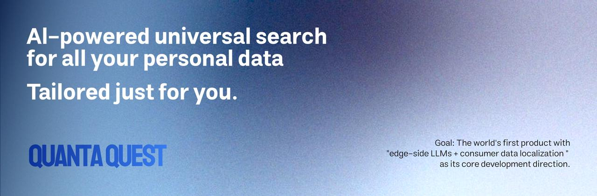
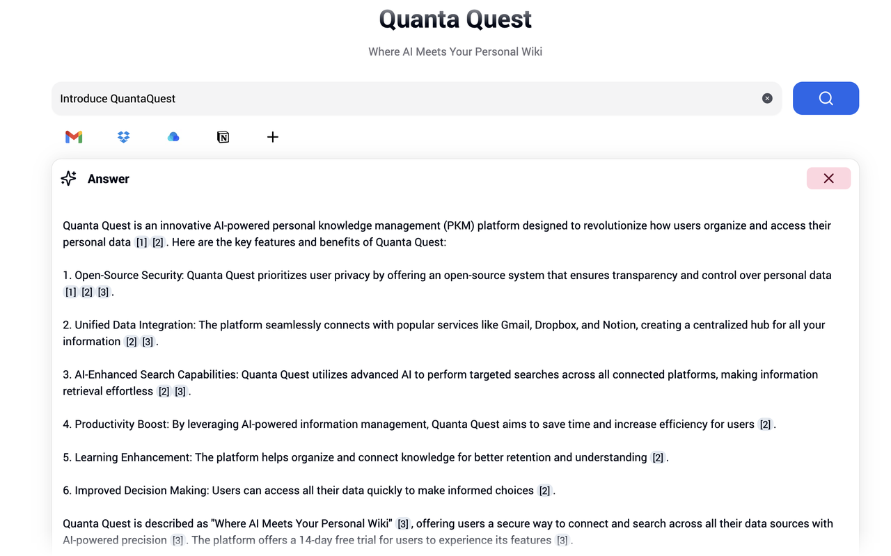
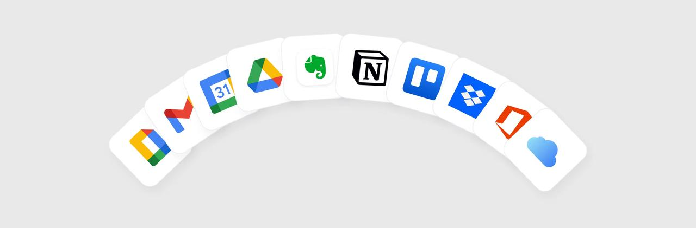

  

    
    
  

  

    
    
    
  

# What's Quanta Quest

全球首个以“端侧大模型+C端数据本地化”为核心演进方向的产品，现阶段实现整合C端所有数据（Gmail、Notion、dropbox等）进行AI搜索

## Quanta Quest前进目标

1. 帮助用户便捷将Gmail、Notion、Dropbox、Calendar、Docs、Drive、iCloud等所有数据存到本地并且用向量数据库处理（重要数据本地化存储、备份，防止数据丢失）；
2. “端侧大模型+专属数据”➡️“专属、私有、端侧大模型（重要数据本地化）”➡️“最了解你的大模型、最隐私的大模型”。用你的专属数据结合越来越普及的端侧大模型，训练出最安全、最注重隐私数据、最了解你的专属端侧大模型。

## 我们深信

1. 未来所有的智能终端都会有端侧大模型；
2. 目前Gmail、Notion、Dropbox、Calendar、Docs等数据是每个人最关键的数据，“端侧大模型”+“专属数据”可以延伸出诸多大机会，比如个性化大模型、个人助理、AI搜索、情感/心理陪护等。

Quanta Quest将持续沿着“专有数据”与“端侧大模型”结合的方向进行完善、探索，专注做好本地数据库安全、AI预处理等基础设施，沿着专属大模型演进

## Quanta Quest当前版本

1. 支持用户连接Notion、Dropbox、Raindrops、Gmail等云端数据到AWS的向量数据库；
2. 结合ChatGPT、Claude等大模型，用RAG实现个性化AI搜索（Perplexica处理所有公开信息，Quanta Quest专注处理个人所有数据，C端用户无法询问Perplexica“明天我有哪些会议”、“xx项目总结到的教训”、“订阅了哪些Newsletter”等等，但这些与你相关的问题都可以询问Quanta Quest）。

## 详细案例图

1. 询问订阅了哪些Newsletter？
   

2. Introduce QuantaQuest

# 跟进发展

为Quanta Quest点Star，跟进后续发展

# 如何部署

## 项目

应用分为**两个部分**：

- 本项目（Next.js）：在这个项目中主要用于页面渲染、鉴权、基础数据查询等。
- quanta-quest-server（FastAPI）：在这个项目中包含数据处理、AI查询、生成等逻辑，以及部分较为复杂的逻辑。所有数据定义以这个项目中的为准。

## 第三方服务依赖

- Kinde
  - 用于用户登录注册，实现多租户
- Stripe
  - 用于用户体验后进行付费订阅
- Database - PostgreSQL
  - 数据库存储应用数据

## 环境变量

- DATABASE_URL - 数据库链接
- BASE_URL - 本项目访问地址
- SERVER_URL - 后端项目访问地址
- PRISMA_LOG_LEVEL - Prisma日志等级配置
- KINDE_CLIENT_ID - Kinde上的项目唯一ID
- KINDE_CLIENT_SECRET - Kinde上的项目密钥（不要分享）
- KINDE_ISSUER_URL - Kinde上的应用地址
- KINDE_SITE_URL - 应用运行的地址
- KINDE_POST_LOGOUT_REDIRECT_URL - 用户登出后跳转的地址
- KINDE_POST_LOGIN_REDIRECT_URL - 用户登录后跳转的地址
- KINDE_DEBUG_MODE - Kinde调试模式
- STRIPE_MONTHLY_PRICE_ID - Stripe月度订阅价格
- STRIPE_QUARTERLY_PRICE_ID - Stripe季度订阅价格
- STRIPE_YEARLY_PRICE_ID - Stripe年度订阅价格
- NEXT_PUBLIC_PUBLISHABLE_KEY - Stripe公开的值
- STRIPE_SECRET_KEY - Stripe密钥

## 运行流程

- 将代码clone到本地，然后进入项目`cd ./quanta-quest-web`
- 设置环境变量，执行`cp .env.example .env`，并按照需求配置环境变量
- 安装依赖，执行`pnpm install`
- 本地运行程序，监听`3000`端口，执行 `pnpm dev`

# 路线图

- [x] Notion
- [ ] Gmail
- [x] Dropbox
- [x] Raindrops
- [ ] 优化RAG查询意图
- [ ] 优化RAG查询后重排序
- [ ] 处理Google Workspace应用申请中CASA安全认证
- [ ] 支持应用范围内向量搜索
- [ ] 更多数据源接入支持

# License

版权所有 2024 Quanta Quest

根据 Quanta Quest 许可证授权：除非遵守许可证，否则您不得使用此项目。

除非适用法律要求或书面同意，根据许可证分发的软件是基于"按原样"提供的，不附带任何明示或暗示的担保或条件。有关许可证下的特定语言管理权限和限制，请参阅许可证。
